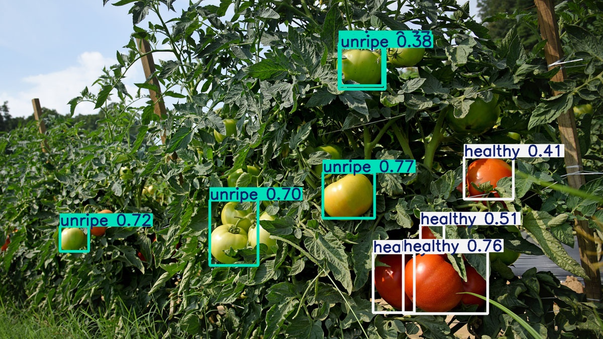
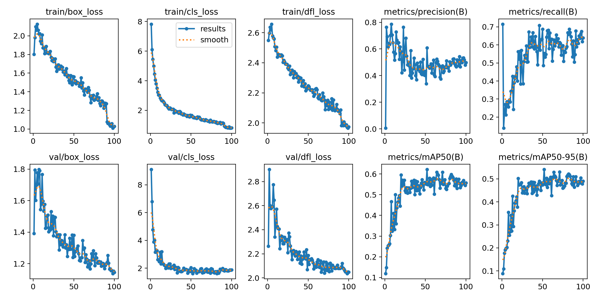

# AI_Tomato_detection
AI-based tomato grading system.
This project uses a YOLOv11.

## Installation
```bash
pip install -r requirements.txt
```

---

## Dataset
- Source: *"Tomates Computer Vision Project"* (Roboflow)  
- Classes: `good_10_40`, `good_40_70`, `healthy`, `unripe`, `rotten`  
- Size: 1025 annotated samples  
- Split: train / valid / test

---

## Tools & Frameworks
- Python, OpenCV, Pandas
- [Ultralytics YOLOv11](https://github.com/ultralytics/ultralytics)
- Roboflow API
- EasyOCR, PyTesseract *(optional)*

---

## Model Training
- 100 training epochs  
- Average **mAP@0.5**: `0.91`  
- Best precision: over 95% for `unripe` and `good_40_70`  
- Confusion mainly between visually similar classes

---

## Evaluation
- Curves: PR, F1, Precision, Recall — see `/results` folder  
- Confusion matrix visualized

---

## Model Results

### Detection on test image


### Detection on video
[▶ Watch detection demo video](https://github.com/AnyKey-Nick/AI_Tomato_detection/blob/21589e0ef985df450d452139760fc72f92c772c3/media/test_video_with_boxes.mp4)

### Performance metrics


---

## Presentation

The project presentation is available on  
[Canva](https://www.canva.com/design/DAGopsSp9Fo/hXp6Wjo_Cd66MePSr-joJA/view)

---

## Inference

**Single image prediction:**
```python
from ultralytics import YOLO
model = YOLO("best.pt")
results = model("Tomato1.jpeg")
results[0].show()
```

**Video detection with object counting:**  
Run:
```bash
python src/detect_from_video.py
```
---


